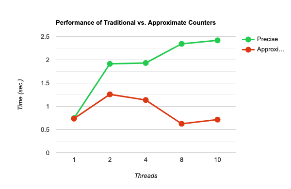

# Concurrent Counter

Analyze the performance of different concurrent counter implementations.  
The following is the environment information.  

- OS: `macOS Montery 12.3`
- CPU: `2.6 GHz Intel Core i7-9750H`
  - Number of logical cores: 12

We make each worker access counter ten million times, and number of threads are $[1,2,4,8,10]$.

## Simple Counter

Just use a big lock to protect the counter.  
The most simple one to implement, however it is not scalable.

| #threads | execution time in ms |
|:--------:|:--------------------:|
|     1    |       746251 ms      |
|     2    |      1913770 ms      |
|     4    |      1933145 ms      |
|     8    |      2344774 ms      |
|    10    |      2418526 ms      |

## Sloppy (Aggregate) Counter

The idea behind Sloppy (Aggregate) counter is, each CPU core has its own local counter, and there is a global counter in system.
Each local counter is protected by a lock, and the global counter is protected by a lock too.
We also set a threshold $S$, it the value of a local counter is greater than or equal to $S$, we need to transfer its value to global counter then set it to zero.
We freeze the following parameters as specific values:

- `threshold`: 10000
- `cpu_nums`: 12

| #threads | execution time in ms |
|:--------:|:--------------------:|
|     1    |       763618 ms      |
|     2    |      1258595 ms      |
|     4    |      1136725 ms      |
|     8    |       626255 ms      |
|    10    |       715077 ms      |